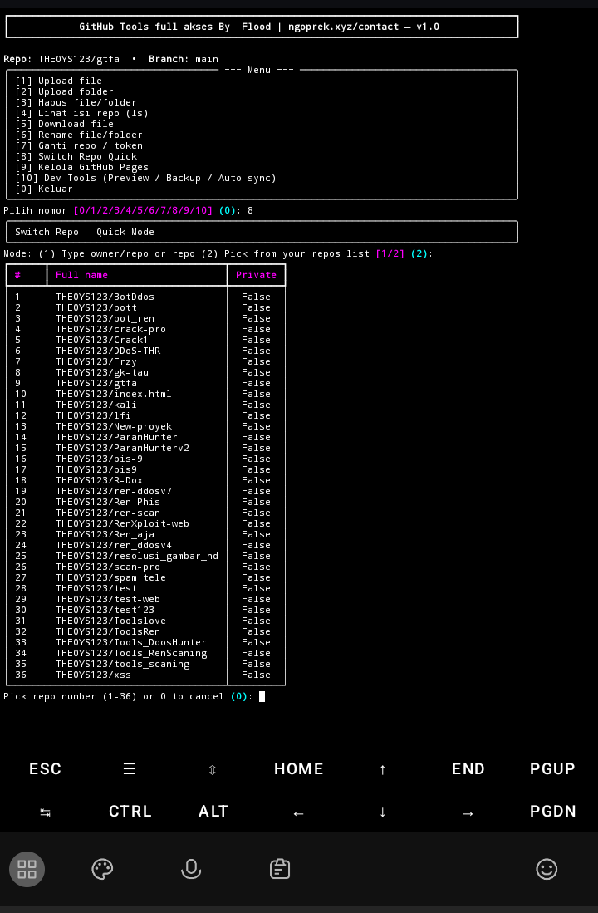
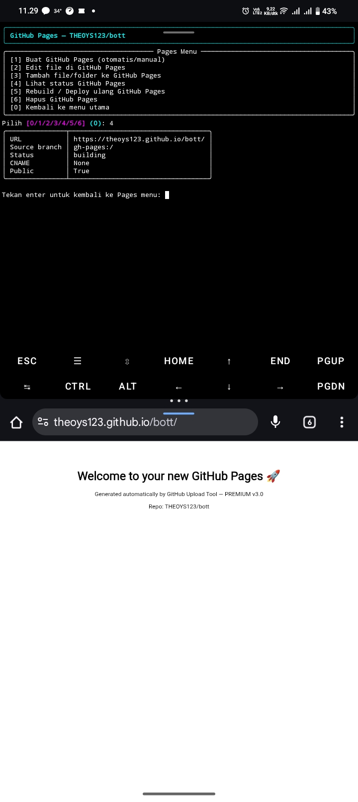

# gtfa tools full akses github
Saya menciptakan tools yang bernama gtfa (Github tools full akses) untuk bisa mempermudah penggunaan.

---

# install using termux
```
pkg install gkt
```
```
git clone https://github.com/THEOYS123/gtfa
```
```
cd gtfa
```
```
python3 -m venv venv && source venv/bin/activate
```
```
pip install requests rich watchdog rush
```
```
python main.py
```

Tools by Flood hunting! | [My contact](oprek.xyz/contact) 


---
# 📸

---
# 📸

---

Tools by Flood hunting! and RenXploit

My Email: support@ngoprek.xyz
My website: ngoprek.xyz
[My contact](oprek.xyz/contact) 
